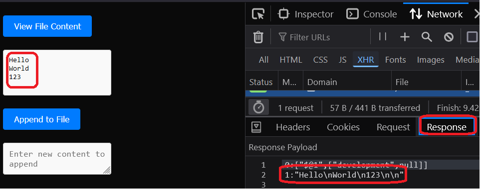
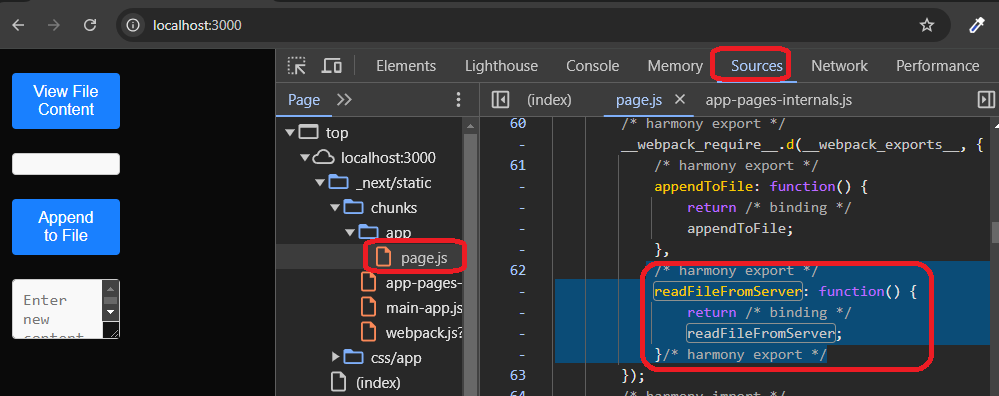

<h1>Project Name</h1>
Next.js App with Server Actions


<h2 id="project-description">Project Description</h2>
This project is a Next.js app that utilizes the new <strong>Next.js 14 server actions</strong> feature. Server actions enable server-side operations (e.g., reading and appending to a file) that can be directly invoked from React components, eliminating the need for separate API routes. 

<h2>Project Motivation</h2>
The motivation behind this project is to explore how to implement server actions in a Next.js application to simplify the interaction between server and client. This README will guide you through setting up, using, and understanding the project structure.


<h2 id="installation">Installation</h2>
To install the required packages, run:

```bash
pnpm i
```

<h2 id="usage">Usage</h2>
To start the development server, use the following command:

```bash
npm run dev
```

<h2>Code snippets</h2>

<h3>Home page</h3>
The main page simply renders a ClientComponent which utilizes the server actions:

```ts
export default function Home() {
  return (
    <>
      <ClientComponent />
    </>
  );
}
```

<h3>Server action file - actions.ts</h3>
The server action file must include the "use server" directive at the top:

```ts
"use server";

import { DATA_DIR } from "@/logic/constants";
import { promises as fs } from "fs";
import path from "path";

export async function readFileFromServer(fileName: string): Promise<string> {
...
}
export async function appendToFile(fileName: string,content: string): Promise<string> {
    ...
}
```

<h3>Server action - readFileFromServer</h3>
Server action is a function - readFileFromServer

```ts
export async function readFileFromServer(fileName: string): Promise<string> {
  const filePath = path.resolve(".", DATA_DIR, fileName);
  try {
    const fileContents = await fs.readFile(filePath, "utf-8");
    return fileContents;
  } catch (error) {
    if (error instanceof Error) {
      return `Error reading file: ${error.message}`;
    } else {
      return "An unknown error occurred";
    }
  }
}
```

<h3>Server action - appendToFile</h3>
Server action is a function - appendToFile

```ts
export async function appendToFile(
  fileName: string,
  content: string
): Promise<string> {
  const filePath = path.resolve(".", DATA_DIR, fileName);
  try {
    await fs.appendFile(filePath, `${content}\n`, 'utf-8'); 
    return "Content appended successfully";
  } catch (error) {
    if (error instanceof Error) {
      return `Error appending to file: ${error.message}`;
    } else {
      return "An unknown error occurred";
    }
  }
}
```

<h3>Use server action in react client component - ClientComponent. Logic part</h3>
The client component must include the "use client" directive at the top:

```ts
"use client";
import { readFileFromServer, appendToFile } from "@/actions/actions";
.....
const ClientComponent: FC = () => {
  const [fileContent, setFileContent] = useState<string>("");
  const [newContent, setNewContent] = useState<string>("");
  const [message, setMessage] = useState<string>("");
  const handleViewFile = async () => {
    const content = await readFileFromServer(EXAMPLE_FILE_NAME);
    setFileContent(content);
  };
  const handleAppend = async () => {
    const response = await appendToFile(EXAMPLE_FILE_NAME, newContent);
    setMessage(response);
    setNewContent(""); // Clear the input after appending
  };
```
<h3>Use server action in react client component - ClientComponent. UI part</h3>

```ts
return (
    <div className={styles.container}>
      <button className={styles.button} onClick={handleViewFile}>
        View File Content
      </button>
      <pre className={styles.fileContent}>{fileContent}</pre>
      <button className={styles.button} onClick={handleAppend}>
        Append to File
      </button>
      <textarea className={styles.textarea}
        value={newContent}
        onChange={(e) => setNewContent(e.target.value)}
        placeholder="Enter new content to append"
      />
      <p className={styles.message}>{message}</p>
    </div>
  );
};
```
<h2 id="demo">Demo</h2>
The main page ui is as follows


<h2 id="points-of-interest">Points of Interest</h2>
<ul>
  <li>
    <h3>Server-Side Execution:</h3> Check the Network tab in Chrome DevTools to see that the file content is a response from the server.
    <br />
    
  </li>
  <li>
    <h3>Code is not Bundled in the Browser:</h3> Check the Sources tab in Chrome DevTools and notice that the code of <code>readFileFromServer</code> does not appear in the browser. This indicates that server actions remain on the server side.
    <br />
    
  </li>
<li>
    <h3>Server actions are implemented by Next.js but are a React feature:</h3> Server actions are part of React’s capabilities, and Next.js simply provides the framework for utilizing them effectively.
  </li></ul>


<h2 id="references">References</h2>
<ul>
    <li>check this <a href='https://www.youtube.com/playlist?list=PLT6u32ApxFVBskjKDMxQZL2kHIj3eeue0'>React Server Component playlist</a> for info on react server componet and react client components</li>
    <li><a href='https://react.dev/reference/rsc/server-actions'>server action in react</a></li>
</ul>

